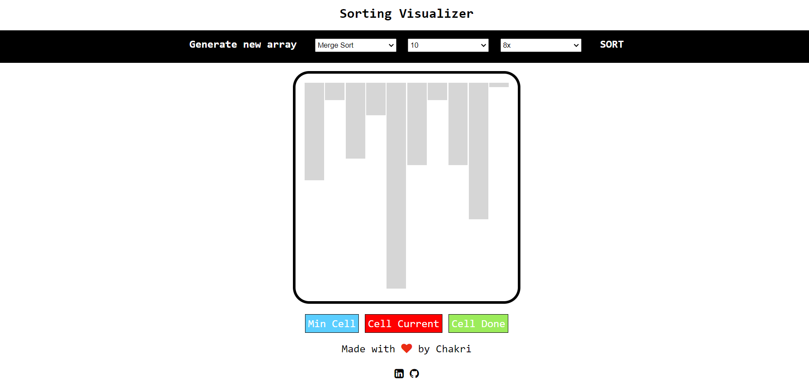

<h2 align="center">
  Sorting Visualizer Website 
  <a href="https://chakri-sorting-algorithm-visualizer.netlify.app/" target="_blank">chakri-sorting-visualizer</a>
</h2>

  

 

## Built With

This <a href="https://chakri-sorting-algorithm-visualizer.netlify.app/"  target="_blank">chakri-sorting-visualizer</a> features visualization of sorting algorithms. 

This project was built using these technologies.

- HTML
- CSS
- JavaScript
- VsCode
- Netlify

## Features

**📖 Single-Page Layout**

**🎨 Styled with Css with easy to customize colors**

**📱 Fully Responsive**

